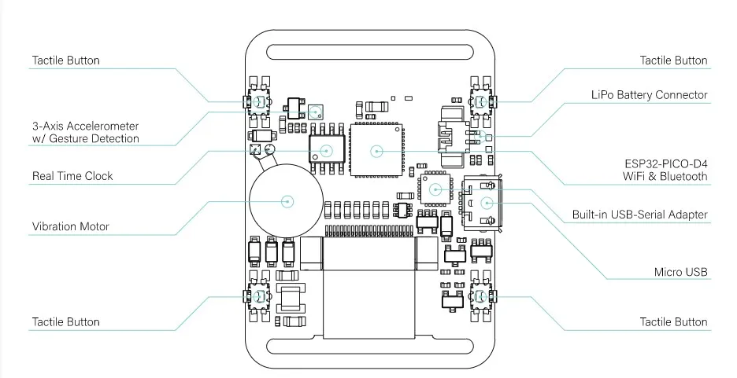
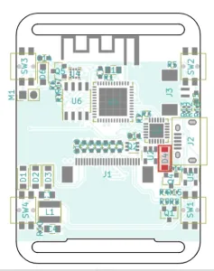

# 🕒 CRONO VIDA

**CRONO VIDA** es un dispositivo wearable basado en el microcontrolador **ESP32-PICO-D4** que ayuda a gestionar horarios de medicación. Utiliza una pantalla E-Paper para mostrar la hora y emite recordatorios vibrantes. Permite interacción vía **Bluetooth** para registrar horarios y ajustar configuraciones, promoviendo una vida más organizada y saludable.

## 🔧 Componentes

Este proyecto se basa en **Watchy 2.0** y utiliza los siguientes componentes:

| Componente                               | Descripción                        |
|------------------------------------------|------------------------------------|
| 🛠️ Microcontrolador ESP32-PICO-D4       | Controlador principal              |
| 💻 USB-Serial CP2104                    | Conversor USB a Serial             |
| 🖥️ E-Paper Display GDEH0154D67         | Pantalla de bajo consumo           |
| 🔌 Display Connector AFC07-S24ECC-00    | Conector de pantalla               |
| 📏 3-Axis Accelerometer BMA423          | Sensor de movimiento                |
| ⏰ Real Time Clock DS3231                | Módulo de reloj en tiempo real    |
| 🔋 Battery LiPo 3.7V 200mAh 402030      | Fuente de alimentación             |

## 📚 Librerías

El proyecto utiliza las siguientes librerías:

- `Arduino.h`
- `DS3232RTC.h`
- `Wire.h`
- `BluetoothSerial.h`
- `GxEPD2_BW.h`

## 🚀 Funcionamiento

**CRONO VIDA** permite a los usuarios gestionar sus horarios de medicación de la siguiente manera:

- **Visualización de Hora y Fecha**: Muestra la hora actual y la fecha en la pantalla E-Paper, actualizándose cada minuto.
- **Registro de Medicamentos**: Los usuarios pueden registrar horarios de toma de medicamentos a través de comandos enviados por Bluetooth.
- **Alertas de Medicación**: Emite vibraciones para recordar a los usuarios cuando es hora de tomar sus medicamentos.
- **Interacción Simple**: Los usuarios pueden ajustar la hora y la fecha, así como consultar la lista de medicamentos registrados mediante comandos específicos.

## 📋 Cómo Usar

1. **Conectar el dispositivo**: Asegúrate de que la batería esté cargada y el dispositivo esté encendido.
2. **Usar Bluetooth**: Conéctate al dispositivo usando un terminal Bluetooth para enviar comandos.
3. **Registrar Medicamentos**: Usa el comando `/registrar <nombre> <hora>` para añadir un medicamento.
4. **Consultar Hora**: La hora se muestra automáticamente en la pantalla, actualizándose cada minuto.
5. **Recibir Alertas**: El dispositivo vibrará para recordarte cuando sea hora de tomar un medicamento registrado.

## 📍 Pinout del ESP32-PICO-D4

| Función                          | Pin  | Descripción                           |
|----------------------------------|------|---------------------------------------|
| **Baudrate**                     | -    | 9600                                  |
| **Nombre Bluetooth**             | -    | "ESP-CLOCK"                           |
| **E-Paper Display GDEH0154D67** |      |                                       |
| Chip Select                      | 5    | Selección del chip                    |
| Reset                            | 9    | Reinicio                              |
| Data/Command                     | 10   | Comando de datos                      |
| Clock                            | 18   | Reloj                                 |
| Busy                             | 19   | Ocupado                               |
| Master Out Slave In (MOSI)      | 23   | Datos del maestro al esclavo          |
| **Acelerómetro BMA423**         |      |                                       |
| Interrupción 1                   | 14   | Primera interrupción                  |
| Interrupción 2                   | 12   | Segunda interrupción                  |
| Serial Data Line (SDA)          | 21   | Línea de datos serial                 |
| Serial Clock Line (SCL)         | 22   | Línea de reloj serial                 |
| **Reloj en Tiempo Real DS3231** |      |                                       |
| SDA (compartido)                | 21   | Línea de datos serial (compartido)   |
| SCL (compartido)                | 22   | Línea de reloj (compartido)          |
| **Botones**                     |      |                                       |
| Botón 1                          | 26   | Primer botón                          |
| Botón 2                          | 25   | Segundo botón                         |
| Botón 3                          | 32   | Tercer botón                          |
| Botón 4                          | 4    | Cuarto botón                          |
| **Buzzer**                       | 13   | Motor de vibración                   |
| **ADC**                          | 33   | Entrada analógica                     |
| **UART**                         |      |                                       |
| UART TX                          | 1    | Transmisión UART                      |
| UART RX                          | 3    | Recepción UART                        |
| **Dimensiones de la Pantalla**  |      |                                       |
| Altura                           | -    | 200                                   |
| Ancho                            | -    | 200                                   |
| **Acceso AP**                    |      |                                       |
| Nombre de AP                     | -    | "EspClock"                            |
| Contraseña de AP                 | -    | "12345"                               |

## 🖼️ Imágenes

## 🤝 Contribuciones

Si deseas contribuir a este proyecto, siéntete libre de hacer un fork y enviar pull requests.

## 📄 Licencia

Este proyecto está bajo la Licencia MIT.

## 📜 Cita

Aggarwal, P. (2021, 7 agosto). Watchy: an open source E-Paper display watch. Pallav Aggarwal. [https://pallavaggarwal.in/2021/07/04/watchy-epaper-display-esp32-smart-watch/](https://pallavaggarwal.in/2021/07/04/watchy-epaper-display-esp32-smart-watch/)
